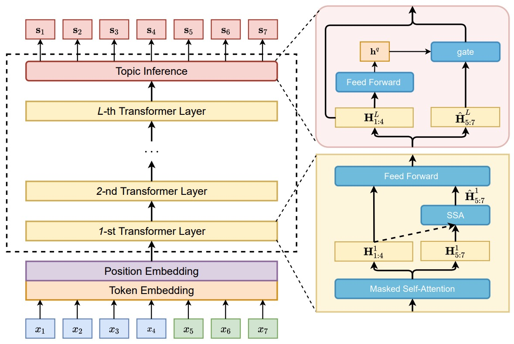

# LM-Dialog
Implementation for our paper entitled "Relevance-Promoting Language Model for Short-Text Conversation" (AAAI 2020). 
<p align="center">
    
</p>

This project is adapted from the following repositories:  
* [https://github.com/lipiji/Guyu](https://github.com/lipiji/Guyu)
* [https://github.com/lipiji/SongNet](https://github.com/lipiji/SongNet)
* [https://github.com/jcyk/BERT](https://github.com/jcyk/BERT)  
* [https://github.com/pytorch/fairseq](https://github.com/pytorch/fairseq)


## Requirements
* torch==1.1.0 (The most recent versions of torch should be applicable but not tested yet)  
* numpy==1.16.4  
* apex==0.9.10dev  
* jieba==0.39  

## Quick Start
1. Identifying query keywords from the original data files:
    ```
    # we employ jieba to obtain the query keywords in an unsupervised manner
    python extract_kw.py.py 
    ```
1. Process the raw data and convert the (Chinese) sentence into character sequence 
    ```
    # check the usage in prepare_data.sh for reference
    python prepare_data.py --src_file [ORIGINAL_DATA_FILE] --tgt_file [TARGET_DATA_FILE] --nprocessors [NUMBER_OF_PROCESSORS]
    ```
1. Identifying keywords for the training responses
    ```
    # you may obtain the new data files with prefix "_with_kw.txt" (say train_with_kw.txt for the training data)
    python extract_kw_resp.py
    ```
1. Training
    ```
    sh train.sh
    ```
1. Evaluation
    ```
    sh eval.sh
    ```
1. Note that our project defaults to Distributed Data Parallel to guarantee the training efficiency

## Other Details
* COMING SOON!

## Citation
If the code is used in your research, hope you can star our repo and cite our paper as follows:
```
@inproceedings{li2020relevance,
  title={Relevance-promoting language model for short-text conversation},
  author={Li, Xin and Li, Piji and Bi, Wei and Liu, Xiaojiang and Lam, Wai},
  booktitle={Proceedings of the AAAI Conference on Artificial Intelligence},
  volume={34},
  number={05},
  pages={8253--8260},
  year={2020}
}
```
    
